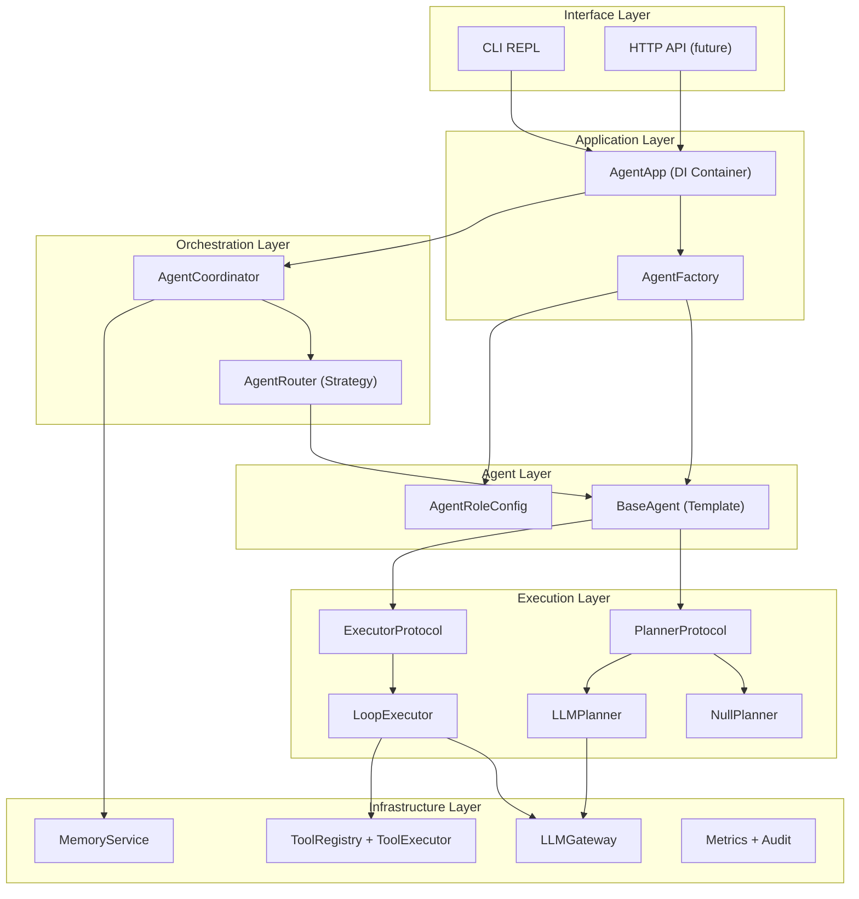
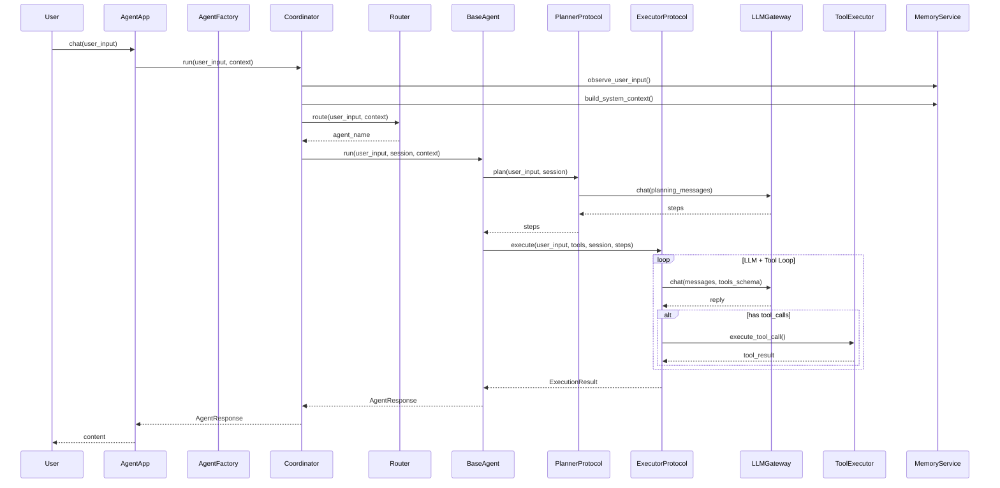

# AI Agent 框架重构：从硬编码到抽象平台化架构

## 一、当前架构问题诊断

### 1.1 抽象不足

- `BaseAgent` 仅有 `name`/`plan()`/`run()` 三个接口，缺少 `system_prompt`、`tool_set` 等角色配置属性，无法通过声明式配置快速实例化不同角色
- `ConversationAgent` 构造函数硬编码注入 5 个依赖（engine, registry, executor, config, memory），新增角色必须重复此模式

### 1.2 硬编码耦合

- `AgentCoordinator` 通过类名字符串 `"ConversationAgent"` 硬编码查找执行 Agent（[coordinator.py](src/agent/coordinator.py) L176-182）
- `PlanningAgent` 的 system_prompt 写死在构造函数默认参数中
- 规划策略只有 开/关 二选一，不支持替换（如 ReAct、ToT 等策略）
- `AgentOrchestrator` 是唯一执行器，无法按场景替换

### 1.3 分层混乱与职责越界

- `coordinator.py` 同文件混合了 `ConversationAgent`、`PlanningAgent`、`AgentCoordinator` 三个不同层次的类
- Memory 更新逻辑散落在 Coordinator 和 Orchestrator 两层（通过 `extra["memory_observed"]` flag 做去重 -- 典型的侵入式设计）
- `AgentOrchestrator` 既管 LLM 循环又管记忆构建和 session 创建，跨越了执行层和应用层的边界
- `AgentCoordinator` 不继承 `BaseAgent`，但承担了类似角色的职责

---

## 二、目标架构（五层 + 两横切）




### 各层职责边界


| 层                  | 职责                                      | 不允许做的事                     |
| ------------------ | --------------------------------------- | -------------------------- |
| **Interface**      | 用户交互（CLI/HTTP），输入解析与输出格式化               | 不碰 Agent 逻辑，不管 session     |
| **Application**    | DI 装配、配置加载、AgentFactory 创建 Agent 实例     | 不包含业务逻辑                    |
| **Orchestration**  | 多 Agent 编排、路由决策、Memory 更新、Session 管理    | 不执行 LLM 调用，不执行 Tool        |
| **Agent**          | 单 Agent 生命周期：plan -> execute -> respond | 不管多 Agent 协调，不管 Memory 持久化 |
| **Execution**      | 可插拔的 Planner 和 Executor 策略实现            | 不管 Agent 选择、不管 session 创建  |
| **Infrastructure** | LLM 网关、工具系统、存储、可观测                      | 纯基础设施，不含业务语义               |


---

## 三、核心抽象设计

### 3.1 AgentRoleConfig -- 声明式角色配置

新增文件 `src/agent/role_config.py`：

```python
@dataclass(frozen=True)
class AgentRoleConfig:
    name: str
    system_prompt: str
    tool_names: list[str] | None = None  # None = 使用全部工具
    planner_type: str = "null"            # "null" | "llm" | 自定义
    executor_type: str = "loop"           # "loop" | 自定义
    max_iterations: int = 5
    metadata: dict[str, Any] = field(default_factory=dict)
```

### 3.2 BaseAgent 重构 -- Template Method Pattern

重构 `src/agent/base_agent.py`：

```python
class BaseAgent(ABC):
    def __init__(
        self,
        config: AgentRoleConfig,
        planner: PlannerProtocol,
        executor: ExecutorProtocol,
        tool_set: ToolSet,
    ):
        self._config = config
        self._planner = planner
        self._executor = executor
        self._tool_set = tool_set

    @property
    def name(self) -> str:
        return self._config.name

    @property
    def system_prompt(self) -> str:
        return self._config.system_prompt

    def run(self, user_input: str, *, context=None, session=None) -> AgentResponse:
        """Template method: plan -> execute -> build response"""
        steps = self._planner.plan(user_input, session=session, context=context)
        result = self._executor.execute(
            user_input, tools=self._tool_set, session=session, context=context, steps=steps,
        )
        return self._build_response(result, steps)

    def _build_response(self, result, steps) -> AgentResponse:
        """Hook: 子类可覆写以自定义响应构建逻辑"""
        return AgentResponse(content=result.content, steps=steps, metadata=result.metadata)
```

### 3.3 Planner Protocol -- Strategy Pattern

新增文件 `src/agent/planner.py`：

```python
class PlannerProtocol(Protocol):
    def plan(self, user_input: str, *, session=None, context=None) -> list[str]: ...

class NullPlanner:
    """不做规划，直接返回空步骤"""
    def plan(self, user_input, *, session=None, context=None) -> list[str]:
        return []

class LLMPlanner:
    """基于 LLM 的规划器（从当前 PlanningAgent 提取）"""
    def __init__(self, engine: LLMEngineProtocol, system_prompt: str = "..."):
        self._engine = engine
        self._system_prompt = system_prompt

    def plan(self, user_input, *, session=None, context=None) -> list[str]:
        # 迁移自 PlanningAgent.plan() 的核心逻辑
        ...
```

### 3.4 Executor Protocol -- Strategy Pattern

新增文件 `src/agent/executor.py`（Agent 层的执行器接口，区别于 tools/executor.py）：

```python
@dataclass
class ExecutionResult:
    content: str
    metadata: dict[str, Any] = field(default_factory=dict)

class ExecutorProtocol(Protocol):
    def execute(
        self, user_input: str, *, tools: ToolSet, session=None, context=None, steps=None,
    ) -> ExecutionResult: ...

class LoopExecutor:
    """LLM + Tool 循环执行器（从当前 AgentOrchestrator 提取核心循环逻辑）"""
    def __init__(self, engine: LLMEngineProtocol, tool_executor: ToolExecutor, config=None):
        ...

    def execute(self, user_input, *, tools, session, context=None, steps=None) -> ExecutionResult:
        # 迁移自 AgentOrchestrator.run() 的 LLM+tool 循环
        # 但不再管 memory、不再管 session 创建
        ...
```

### 3.5 ToolSet -- 工具子集抽象

```python
class ToolSet:
    """Agent 持有的工具子集视图，基于 ToolRegistry 过滤"""
    def __init__(self, registry: ToolRegistry, allowed_names: list[str] | None = None):
        self._registry = registry
        self._allowed = set(allowed_names) if allowed_names else None

    def to_openai_tools(self) -> list[dict]:
        if self._allowed is None:
            return self._registry.to_openai_tools()
        return [t.spec.to_openai_schema() for t in self._registry.list_tools()
                if t.name in self._allowed]
```

### 3.6 AgentFactory -- 工厂模式

新增 `src/agent/factory.py`：

```python
class AgentFactory:
    def __init__(self, engine, tool_registry, tool_executor, planner_registry, executor_registry):
        ...

    def create(self, config: AgentRoleConfig) -> BaseAgent:
        planner = self._planner_registry.get(config.planner_type)
        executor = self._executor_registry.get(config.executor_type)
        tool_set = ToolSet(self._tool_registry, config.tool_names)
        return ConfigurableAgent(config=config, planner=planner, executor=executor, tool_set=tool_set)
```

### 3.7 AgentRouter -- 替代硬编码查找

```python
class AgentRouter(Protocol):
    def route(self, user_input: str, context: Any) -> str:
        """返回应处理此请求的 Agent 名称"""
        ...

class DefaultRouter:
    """始终路由到默认 Agent"""
    def __init__(self, default_agent_name: str):
        self._default = default_agent_name

    def route(self, user_input, context=None) -> str:
        return self._default
```

---

## 四、重构前后对比

### Memory 更新职责

- **Before**: 散落在 Coordinator(L157-163) 和 Orchestrator(L67-75)，通过 `extra["memory_observed"]` 去重
- **After**: 仅在 Coordinator 层处理，Executor 完全不感知 Memory

### Agent 选择逻辑

- **Before**: `self._agents.get("ConversationAgent")` 硬编码类名查找
- **After**: `self._router.route(user_input, context)` 策略化路由

### Planner/Executor 替换

- **Before**: `PlanningAgent` 是具体类，开关控制；`AgentOrchestrator` 是唯一执行器
- **After**: `PlannerProtocol` / `ExecutorProtocol` 是接口，通过 `AgentRoleConfig.planner_type` / `executor_type` 声明式选择

### 新增 Agent 角色

- **Before**: 需新建类、修改 `app.py` 装配逻辑、修改 `coordinator.py` 查找逻辑
- **After**: 只需定义一个 `AgentRoleConfig` 并注册到 Factory

---

## 五、文件变更清单


| 操作     | 文件                                        | 说明                                                                                    |
| ------ | ----------------------------------------- | ------------------------------------------------------------------------------------- |
| **新增** | `src/agent/role_config.py`                | AgentRoleConfig 声明式角色配置                                                               |
| **新增** | `src/agent/planner.py`                    | PlannerProtocol + NullPlanner + LLMPlanner                                            |
| **新增** | `src/agent/agent_executor.py`             | ExecutorProtocol + LoopExecutor + ExecutionResult                                     |
| **新增** | `src/agent/tool_set.py`                   | ToolSet 工具子集视图                                                                        |
| **新增** | `src/agent/factory.py`                    | AgentFactory + PlannerRegistry + ExecutorRegistry                                     |
| **新增** | `src/agent/router.py`                     | AgentRouter Protocol + DefaultRouter                                                  |
| **重构** | `src/agent/base_agent.py`                 | 升级为 Template Method，持有 config/planner/executor/tool_set                               |
| **重构** | `src/agent/coordinator.py`                | 移除 ConversationAgent/PlanningAgent 具体类；引入 Router；Memory 职责收拢                          |
| **重构** | `src/agent/orchestrator.py`               | 剥离为纯 LoopExecutor，移除 memory/session 创建逻辑                                              |
| **重构** | `src/agent/app.py`                        | 使用 AgentFactory 装配，消除硬编码创建逻辑                                                          |
| **重构** | `src/agent/session.py`                    | 保持不变（Session 职责清晰）                                                                    |
| **重构** | `src/agent/response.py`                   | 保持不变                                                                                  |
| **重构** | `src/agent/memory.py`                     | 保持不变（Memory 层已抽象良好）                                                                   |
| **更新** | `src/agent/__init__.py`                   | 导出新增类型                                                                                |
| **更新** | `tests/test_agent_e2e.py`                 | 适配新接口                                                                                 |
| **更新** | `tests/test_reliability_observability.py` | 适配新接口                                                                                 |
| **删除** | 无需删除文件                                    | PlanningAgent/ConversationAgent 从 coordinator.py 中移除，逻辑迁移至 planner.py 和 base_agent.py |


---

## 六、重构后的数据流




---

## 七、演进式重构步骤

采用**自底向上、逐层替换**的策略，每一步确保测试通过：

**Phase 1** (基础抽象层): 新增 Protocol 和数据结构文件，不改动现有代码，确保现有测试全部通过

**Phase 2** (执行层重构): 从 `AgentOrchestrator` 中提取 `LoopExecutor`，实现 `ExecutorProtocol`；从 `PlanningAgent` 中提取 `LLMPlanner`，实现 `PlannerProtocol`

**Phase 3** (Agent 层重构): 重构 `BaseAgent`，引入 Template Method；创建 `ConfigurableAgent` 替代 `ConversationAgent`

**Phase 4** (编排层重构): 重构 `AgentCoordinator`，引入 Router，收拢 Memory 职责，移除硬编码 Agent 查找

**Phase 5** (应用层重构): 重构 `AgentApp`，引入 `AgentFactory`，声明式装配

**Phase 6** (清理与验证): 移除废弃代码，更新测试，更新文档

---

## 八、核心功能保障

以下功能在每个 Phase 结束时必须通过回归验证：

- Action 执行: LLM 决策 -> ToolExecutor 执行 -> 结果回写 session -> 继续循环
- 上下文回传: RequestContext(request_id, trace_id, deadline) 全链路透传
- 会话历史: session.messages 在多轮对话中正确保持
- 记忆系统: observe_user_input + build_system_context 正确工作
- 连续失败兜底: consecutive_tool_failures 达阈值时让模型收敛输出

