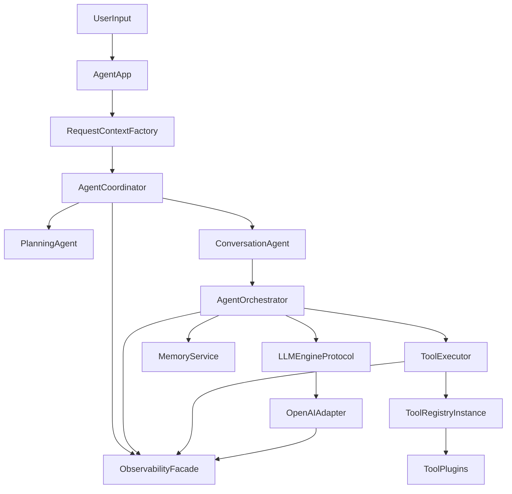

# Jarvis 商业级架构升级计划

## 目标与范围

- 目标：将当前基础 Agent 项目升级为可长期演进的商业级架构，优先保障 **reliability / observability / extensibility**。
- 范围：允许较大重构（你已确认），可调整模块边界与内部接口，但保持 CLI 用户侧行为稳定。

## 现状关键问题（已验证）

- 会话隔离不一致：`AgentOrchestrator` 默认复用 `self.session`，存在跨请求历史污染风险；而多 Agent 路径每轮新建会话，策略不统一。见 `[src/agent/orchestrator.py](src/agent/orchestrator.py)`、`[src/agent/coordinator.py](src/agent/coordinator.py)`。
- 编排职责重复：多 Agent 模式下 memory 观察与 planning 存在重复链路，造成 token 浪费与语义不稳定。见 `[src/agent/app.py](src/agent/app.py)`、`[src/agent/coordinator.py](src/agent/coordinator.py)`。
- Engine 抽象泄漏：上层直接依赖 OpenAI SDK 响应结构（`choices[0].message`），provider 可替换性不足。见 `[src/engine/base.py](src/engine/base.py)`、`[src/agent/orchestrator.py](src/agent/orchestrator.py)`。
- 工具可靠性薄弱：`execute_tool_call` 对 JSON 参数解析无保护，且重试未区分幂等工具。见 `[src/tools/executor.py](src/tools/executor.py)`、`[src/tools/base.py](src/tools/base.py)`。
- 可观测性缺口：缺少 request/trace 贯通、统一结构化日志、metrics 与审计事件。见 `[src/main.py](src/main.py)` 及 `src/agent|src/tools|src/engine` 全链路。
- 工程门禁缺失：缺 CI、类型检查与覆盖率门槛，文档与实现存在漂移。见 `[tests/test_agent_e2e.py](tests/test_agent_e2e.py)`、`[docs/ARCHITECTURE.md](docs/ARCHITECTURE.md)`。

## 目标架构（重构后）

## 分阶段实施

### Phase 1：边界收敛与行为止血（优先）

- 统一会话策略：每次请求都显式创建 `AgentSession`，禁止 orchestrator 隐式复用旧 session。
- 统一编排职责：
  - 多 Agent：`PlanningAgent` 负责 steps；`ConversationAgent` 不再重复生成占位 steps。
  - memory 观察只保留一个入口（建议在 `AgentCoordinator`/单 Agent runner 的 request 入口）。
- 引入 `RequestContext`（`request_id`, `trace_id`, `session_id`, `deadline`），并在 App -> Coordinator/Orchestrator -> Engine/Tool 全链路透传。
- 关键文件：`[src/agent/app.py](src/agent/app.py)`、`[src/agent/coordinator.py](src/agent/coordinator.py)`、`[src/agent/orchestrator.py](src/agent/orchestrator.py)`、`[src/tools/context.py](src/tools/context.py)`。

### Phase 2：可靠性与可观测性基座

- 工具执行可靠性：
  - `execute_tool_call` 增加 JSON decode 保护与可恢复降级。
  - `ToolSpec` 增加幂等元数据（如 `idempotent`），重试仅对幂等工具生效。
- 引擎契约化：定义 `LLMEngineProtocol` + 统一回复 DTO，业务层不再访问 provider 原生结构。
- 可观测性落地：
  - 统一日志字段（至少 `request_id trace_id component event latency_ms outcome error_code`）。
  - 指标最小集（LLM/Tool 成功率、延迟、重试次数、迭代次数）。
  - 审计事件（工具调用、记忆更新、失败升级）。
- 关键文件：`[src/engine/base.py](src/engine/base.py)`、`[src/tools/base.py](src/tools/base.py)`、`[src/tools/executor.py](src/tools/executor.py)`、`[src/main.py](src/main.py)`；新增 `src/observability/*` 与 `src/common/errors.py`。

### Phase 3：可扩展性与工程质量

- 去全局单例与导入副作用：改为 `AgentApp` 显式装配 `ToolRegistry/ToolExecutor` 与插件加载。
- 配置升级：将 `[src/config.py](src/config.py)` 从松散 dict 升级为强类型 settings（含校验、fail-fast）。
- 测试补齐：
  - 新增 reliability/observability 契约测试（超时、重试、幂等、trace 透传）。
  - 补多 Agent 编排一致性测试。
- 工程门禁：补 CI（pytest + ruff + mypy + 覆盖率阈值）。

## 设计取舍（供你确认）

- 兼容策略：保持 `AgentApp.chat(user_input)->str` 对外不变，内部改为“请求级上下文 + 协议适配”。
- 演进策略：先可运行再增强（Phase 1/2 先实现最小可用，再扩展 Prometheus/OpenTelemetry）。
- 风险控制：每一阶段都附带回归测试，避免一次性大改造成行为回退。

## 验收标准

- 无会话串话：连续多轮调用不会互相污染上下文。
- 多 Agent 流程无重复规划/重复记忆写入。
- 工具参数异常不会导致主流程崩溃。
- 日志可按 `request_id` 贯穿检索单次请求链路。
- 增强测试通过，且关键路径覆盖率显著提升（目标可在实施阶段具体化）。

