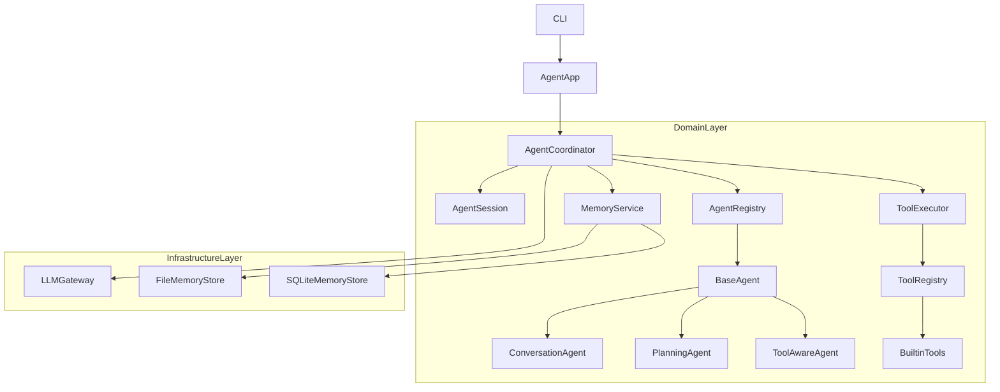
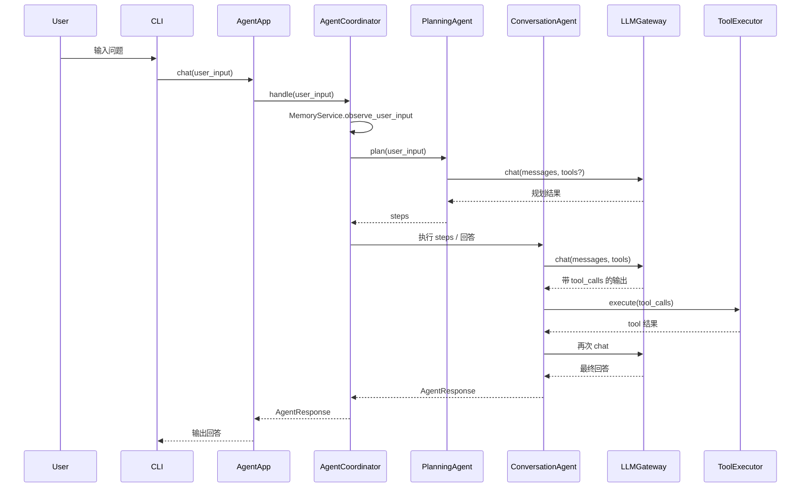

# Jarvis 商业级重构规划

## 1. 总体目标

- **从教学样板升级为商业级框架**：清理以“教学/学习”为主的内容，保留和新增面向真实使用场景的文档与代码结构。
- **保持 CLI 为主要运行形态**：继续以命令行 REPL 为主入口，但内部架构按高可用服务标准设计（清晰分层、可插拔、可观测、可测试）。
- **核心改造点**：
  - 删除/重写学习型文档与教学痕迹。
  - 重塑严格分层架构（Interface / Application / Domain / Infrastructure）。
  - 强化 LLM 调用与工具执行的错误处理与重试机制。
  - 将记忆系统升级为结构化、可插拔、默认 SQLite 的实现，并兼容本地文件存储。
  - 引入 `BaseAgent` 抽象与多 Agent 协作能力，替代当前过于简单的 Planner。

## 2. 分层架构重设计

### 2.1 目标分层

规划 4 个主要层级，对现有代码进行归类与重构：

- **Interface Layer（接口层）**
  - 现有：`[agent.py](agent.py)`、`[src/main.py](src/main.py)`。
  - 职责：
    - 提供 CLI REPL 入口（后续可扩展 HTTP 入口）。
    - 只负责 IO（读写终端/HTTP 请求），不包含业务逻辑。
- **Application Layer（应用编排层）**
  - 现有：`[src/agent/app.py](src/agent/app.py)`、`[src/agent/orchestrator.py](src/agent/orchestrator.py)` 部分职责。
  - 目标：
    - `AgentApp` 继续作为应用壳，负责依赖注入与配置装配。
    - 引入 `AgentCoordinator`（或重构现有 `AgentOrchestrator`）作为多 Agent 的编排者，而不是“单一智能体内核”。
    - 在此层引入 `AgentRegistry` 或简单的 agent 注册机制，用于管理多个 `BaseAgent` 实例。
- **Domain Layer（领域层）**
  - 现有：
    - Agent 相关：`[src/agent/orchestrator.py](src/agent/orchestrator.py)`、`[src/agent/session.py](src/agent/session.py)`、`[src/agent/planner.py](src/agent/planner.py)`、`[src/agent/response.py](src/agent/response.py)`。
    - Tool 相关：`[src/tools/base.py](src/tools/base.py)`、`[src/tools/registry.py](src/tools/registry.py)`、`[src/tools/executor.py](src/tools/executor.py)`、`[src/tools/context.py](src/tools/context.py)` 以及 builtin 工具。
    - Memory 相关：`[src/agent/memory.py](src/agent/memory.py)`。
  - 目标：
    - 新增 `BaseAgent` 抽象与具体 Agent 实现（例如 `ConversationAgent`、`PlanningAgent` 等）。
    - 保持 Tool 体系（Spec/Registry/Executor）为 domain 层核心能力。
    - 将 Memory 服务重构为结构化、可插拔的领域能力（细节见第 5 节）。
- **Infrastructure Layer（基础设施层）**
  - 现有：`[src/engine/base.py](src/engine/base.py)`、`[src/config.py](src/config.py)`、`requests` 调用等。
  - 目标：
    - 保持 `LLMGateway` 作为唯一 LLM 出入口，新增重试与超时策略配置。
    - 拆分/增强存储实现（File + SQLite），暴露统一接口给 Memory 服务。
    - 集中放置日志、配置、重试策略等基础设施。

### 2.2 新架构示意

- 计划将现有 `AgentOrchestrator` 的职责拆分为：
  - `AgentCoordinator`：负责一次会话中多 Agent 的协作流程（调用哪个 Agent、何时切换、何时结束）。
  - 一个或多个 `BaseAgent` 子类：每个子类聚焦一个“角色/能力”。

## 3. 学习文档与教学痕迹清理

### 3.1 删除明显教学向文档

- 计划直接删除以下文件：
  - `[docs/TEACHING_PLAN.md](docs/TEACHING_PLAN.md)`：学习路线说明，完全为教学用途。
- 对以下文档做“去教学化”与重写，而非简单删除：
  - `[docs/OVERVIEW.md](docs/OVERVIEW.md)`：保留为“产品/框架总览”，移除“学习路径”相关段落，改为面向使用者的简介。
  - `[docs/ARCHITECTURE.md](docs/ARCHITECTURE.md)`：保留为“架构说明”，将措辞从“学习/演进”改为“设计目标/约束/扩展点”。
  - `[docs/DESIGN_AGENT.md](docs/DESIGN_AGENT.md)`、`[docs/DESIGN_TOOLS.md](docs/DESIGN_TOOLS.md)`、`[docs/DESIGN_MEMORY.md](docs/DESIGN_MEMORY.md)`、`[docs/DESIGN_LLMGATEWAY.md](docs/DESIGN_LLMGATEWAY.md)`：从“教学讲解”调整为“内部设计文档”，用更偏工程规范的语言描述模块职责、接口约定、错误处理、性能与扩展性等。

### 3.2 README 与说明内容调整

- 更新 `[README.md](README.md)`：
  - 去掉明显“学习项目”“教学示例”等表述。
  - 增加“商业级特性”章节，如：稳定性、错误重试、可插拔记忆后端、多 Agent 能力、日志与配置。
  - 明确说明默认使用 SQLite 作为长期记忆后端，文件后端主要用于简单/无依赖场景。

## 4. 错误处理与重试机制增强

### 4.1 LLMGateway 级别重试

- 在 `[src/engine/base.py](src/engine/base.py)` 中为 `LLMGateway.chat` 增加：
  - **配置化重试策略**：从 `[src/config.py](src/config.py)` 中读取，例如：
    - `LLM_MAX_RETRIES`
    - `LLM_BASE_BACKOFF_MS`
    - `LLM_MAX_BACKOFF_MS`
    - `LLM_TIMEOUT_SECONDS`
  - **错误分类**：
    - 网络类暂时性错误（连接失败、超时、5xx）→ 可重试。
    - 客户端错误（4xx、参数错误、认证失败）→ 不重试，直接失败。
  - **退避算法**：
    - 指数退避 + 抖动（jitter），避免过于密集地打接口。
  - **日志与指标**：
    - 每次重试记录 attempt、原因、等待时长，在日志中可追踪。

### 4.2 ToolExecutor 级别重试

- 在 `[src/tools/executor.py](src/tools/executor.py)` 中扩展：
  - 为 `ToolExecution` 或 `ToolResult` 增加简单的 `retryable` 概念（可通过工具元数据或约定来决定）。
  - 对于网络型工具（如 `[src/tools/builtin/http.py](src/tools/builtin/http.py)`）：
    - 增加内部重试：对超时、特定 5xx 错误做有限次数重试。
    - 通过 `ToolResult.metadata` 返回是否触发过重试、最终状态等信息。
  - 保证 **默认行为安全**：
    - 不对非幂等工具做自动重试，后续需要可在工具注册时标记 `idempotent=True` 再做更激进处理。

### 4.3 CLI 层的错误友好性

- 在 `[src/main.py](src/main.py)` 的 REPL 循环中：
  - 对 `app.chat(user_input)` 包一层 try/except：
    - 捕获未处理异常，输出用户可理解的错误信息（例如“当前服务出现异常，请稍后重试”），并继续 REPL，而不是直接退出。
    - 在日志中记录完整 traceback，便于排查。

## 5. 记忆系统重构（文件 + SQLite，可插拔）

### 5.1 抽象接口与模型

- 在 `[src/agent/memory.py](src/agent/memory.py)` 中：
  - 保留并加强 `BaseMemoryStore`：
    - 增加更通用的方法签名，例如：
      - `get(namespace: str, key: str) -> Any`
      - `set(namespace: str, key: str, value: Any) -> None`
      - `query(namespace: str, filters: Dict[str, Any]) -> List[Dict[str, Any]]`（为后续扩展预留）。
  - 引入更结构化的领域模型：
    - `UserProfileMemory`：如 `user_name`、`preferred_language`、`timezone` 等。
    - `PreferenceMemory`：如写作风格偏好、温度偏好等（预留字段）。
    - 统一通过 `MemoryService` 对外暴露高层 API，如：
      - `get_user_profile()` / `update_user_profile(...)`
      - `apply_observation(user_input: str)`：从用户输入中提取增量记忆。

### 5.2 存储实现：文件 + SQLite

- **FileMemoryStore（本地文件）**：
  - 继续保留当前 JSON 文件实现，但迁移为基于 `namespace + key` 的结构化存储。
  - 主要用于：无外部依赖、轻量单机场景。
- **SQLiteMemoryStore（默认实现）**：
  - 新增 `SQLiteMemoryStore` 实现：
    - 使用单一 SQLite 文件（路径由 `[src/config.py](src/config.py)` 提供，如 `AGENT_CONFIG["memory_db_path"]`）。
    - 设计一张或几张简单表（如 `memory_items`，字段：`id`, `namespace`, `key`, `value_json`, `updated_at`）。
    - 实现与 `BaseMemoryStore` 兼容的接口（`get/set/query`）。
  - 在 `[src/config.py](src/config.py)` 中：
    - 将 `memory_backend` 默认改为 `"sqlite"`。
    - 同时支持 `"file"` 和未来的其他实现（如 Redis）。

### 5.3 记忆提取逻辑升级

- 现状：`MemoryService.observe_user_input` 用少量 if/else + 正则判断用户名字与语言。
- 目标：将其升级为 **可扩展的规则集合**，避免“散落的 if-else”：
  - 定义一组“观察器（Observer）”或规则函数：
    - 如 `NameObserver`、`LanguageObserver`、`TimezoneObserver` 等，每个实现 `apply(snapshot, user_input) -> changed_fields`。
  - `MemoryService.observe_user_input` 只负责：
    - 依次调用各个 Observer，将变更合并到 snapshot。
    - 统一保存到 `BaseMemoryStore`。
  - 后续若要扩展新的记忆类型（比如“常驻城市”“公司名称”等），只需新增一个 Observer 类，而无需在一个大函数里堆叠 if-else。

### 5.4 与 Agent 的集成

- 在 Application/Domain 层中：
  - `AgentCoordinator` 在构造/启动 session 时：
    - 调用 `MemoryService.build_system_context()` 生成结构化记忆提示，注入 system prompt。
  - 在每轮对话开始前：
    - 调用 `MemoryService.observe_user_input(user_input)` 更新记忆。
  - 确保多 Agent 共享同一份 MemoryService/Store，以便协作时保持一致的用户画像。

## 6. 多 Agent 与 BaseAgent 抽象设计

### 6.1 BaseAgent 抽象

- 在新建或重构的模块（例如 `[src/agent/base_agent.py](src/agent/base_agent.py)` 或现有 `orchestrator` 中）定义：
  - 抽象类 `BaseAgent`，核心方法：
    - `plan(self, user_input: str, session: AgentSession) -> List[str]`：可选的规划步骤。
    - `build_messages(self, user_input: str, session: AgentSession) -> List[Dict[str, Any]]`：构造传给 LLM 的 messages（可基于 session 和 memory）。
    - `select_tools(self, user_input: str) -> List[Dict[str, Any]]`：当前 Agent 认为需要暴露给 LLM 的工具集合。
    - `handle_model_output(self, model_output, session: AgentSession) -> AgentResponse | None`：处理一次 LLM 输出，判断是否已得到最终答案或需要继续迭代/调用工具。
  - `BaseAgent` 中可复用现有 `AgentSession` / `ToolExecutor` / `LLMGateway` 逻辑，鼓励子类组合而非复制代码。

### 6.2 具体 Agent 实现

- **ConversationAgent**（普通对话代理）：
  - 聚焦一般任务，工具集包括基础工具（时间、加法、HTTP 等）。
  - 使用 MemoryService 注入用户画像。
- **PlanningAgent**（规划专长代理）：
  - 取代当前 `Planner` 的“仅 prompt 片段”形式，变为一个真正的 Agent：
    - 接收任务描述，输出结构化任务分解（steps），可持久化到 `AgentResponse.steps`。
  - 在 `AgentCoordinator` 中：
    - 可以选择性先调用 `PlanningAgent` 获取计划，再交给其他 Agent 执行。
- **ToolAwareAgent**（工具执行强化代理，可与 ConversationAgent 合并或单独存在）：
  - 优化对工具调用与结果解释，适合需要大量工具交互的场景。

### 6.3 AgentCoordinator / Orchestrator 重构

- 将现有 `[src/agent/orchestrator.py](src/agent/orchestrator.py)` 重构为：
  - `AgentCoordinator`：
    - 持有：`AgentSession`、`MemoryService`、`LLMGateway`、`ToolRegistry`/`ToolExecutor`、多个 `BaseAgent` 实例。
    - 流程：
      1. 接收用户输入，更新 Memory。
      2. 决定先由哪个 Agent 处理（例如：先 `PlanningAgent`，再 `ConversationAgent`）。
      3. 驱动 Agent 的 `plan/build_messages/select_tools/handle_model_output`，在必要时循环调用 LLM 和工具。
      4. 汇总得到最终 `AgentResponse`，记录 `phase_log` / agent 轨迹等元数据。

### 6.4 Planner 模块的过渡策略

- 保留现有 `[src/agent/planner.py](src/agent/planner.py)` 作为 **向后兼容的轻量 Planner**，但：
  - 在新架构中，将其视为 `PlanningAgent` 的简单实现或“降级路径”。
  - 提供配置开关：
    - 使用老的 prompt-based Planner。
    - 或启用新的 `PlanningAgent` 多 Agent 模式。

## 7. 渐进式迁移与兼容性

- **阶段 1**：
  - 清理/重写文档与 README，更新配置（但保持旧接口行为不变）。
  - 在不破坏现有 `AgentApp.chat()` / CLI 行为的前提下，引入新的重试机制和 Memory 抽象（可先在内部使用，外部接口保持兼容）。
- **阶段 2**：
  - 引入 `BaseAgent` 与新的 `AgentCoordinator`，先让其包装当前单 Agent 流程（即只注册一个 `ConversationAgent`）。
  - 确认 CLI 行为与现有版本功能等价。
- **阶段 3**：
  - 增强记忆系统（Observers、SQLite 后端）、完善多 Agent（PlanningAgent 等），并在配置中提供开关以便灰度启用多 Agent 模式。
- **阶段 4**：
  - 整理最终设计文档，明确对外的“公共 API”（例如 `AgentApp`、各配置项、扩展点）。

## 8. 实施任务列表（高层 TODO）

- **文档与学习内容清理**
  - 删除教学向文档，重写 README 与架构文档为“工程化/产品化”风格。
- **配置与基础设施调整**
  - 在 `config` 中加入 LLM 重试参数与记忆后端配置（含 SQLite 路径），准备迁移。
- **错误处理与重试机制**
  - 在 LLMGateway 与 ToolExecutor 中实现配置化重试、错误分类、日志增强，并在 CLI 层兜底异常。
- **记忆系统重构**
  - 设计并实现结构化 Memory 模型、Observer 机制，以及 File/SQLite 双存储实现，调整 MemoryService 接口。
- **多 Agent 与 BaseAgent**
  - 设计并实现 BaseAgent 抽象、ConversationAgent/PlanningAgent 等子类，以及新的 AgentCoordinator；逐步迁移现有 Orchestrator 逻辑。
- **回归与文档**
  - 为新架构补充基础测试（尤其是 Memory、重试、多 Agent 协作），同步更新内部设计文档。

