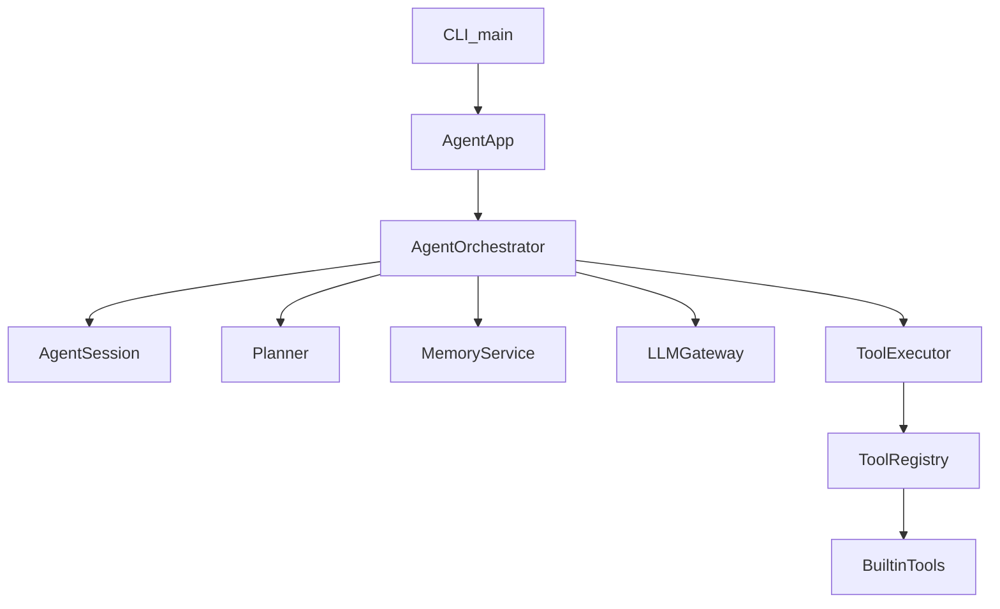
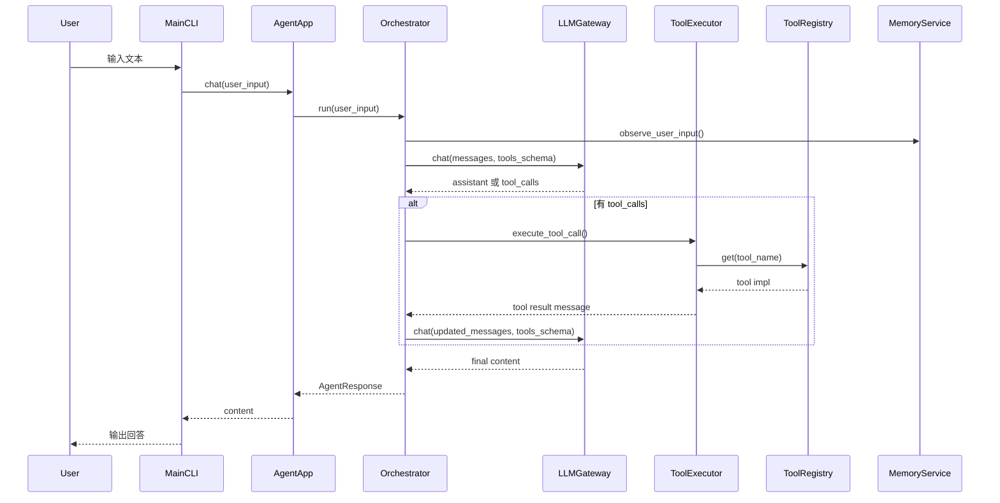

## Jarvis 架构说明

> 描述当前实现对应的分层架构、模块职责与运行时数据流；约束与扩展点供实现与演进时对齐。

---

## 1. 架构目标与约束

- **分层清晰**：Interface（CLI/入口）→ Application（App/Coordinator）→ Domain（Agent/Session/Tools/Memory）→ Infrastructure（LLMGateway/存储/配置）。
- **单一职责**：每层只依赖下层接口，不跨层直连实现。
- **可替换性**：记忆存储、LLM provider、工具集均可通过接口与配置替换，无需改业务编排。
- **可观测与可测试**：关键路径打点；LLM/Tool 可注入 mock 便于单测与集成测试。

---

## 2. 顶层分层图

（多 Agent 演进后：app → AgentCoordinator → AgentRegistry → BaseAgent 子类；Memory/LLM/Tools 由 Coordinator 统一持有并注入各 Agent。）

---

## 3. 关键模块职责

### 3.1 接口层（Interface）

- `agent.py`：顶层脚本，转发至 `src.main.main()`。
- `src/main.py`：CLI REPL；读取输入、调用 `AgentApp.chat()`、输出结果；对未捕获异常做友好提示并保持 REPL 不退出。

### 3.2 应用编排层（Application）

- `src/agent/app.py`：`AgentApp` 依赖注入与装配（LLMGateway / Planner / MemoryService / Orchestrator 或 Coordinator）；对外 `chat(user_input) -> str`。`AgentAppConfig` 统一控制 provider、迭代上限、planner、memory 后端与路径。

### 3.3 领域层（Domain）

- **编排核心**：`orchestrator.py` 中 `AgentOrchestrator` 负责单次请求的主循环（记忆观察 → 会话更新 → LLM 调用 → 工具执行与消息回写 → 产出 AgentResponse）。未来由 `AgentCoordinator` 管理多 Agent 协作。
- **会话**：`session.py` 中 `AgentSession` 管理 messages（append_user / append_assistant / append_assistant_tool_calls / append_tool_message）。
- **规划**：`planner.py` 中 `Planner` 提供规划提示与步骤占位；可演进为 PlanningAgent。
- **记忆**：`memory.py` 中 `MemoryService` 对外提供 build_system_context、observe_user_input；存储由 `BaseMemoryStore` 抽象，实现包括 File / SQLite。
- **工具**：`tools/base.py`（ToolSpec / BaseTool / FunctionTool / ToolResult）、`registry.py`（ToolRegistry）、`executor.py`（ToolExecutor）、`context.py`（ToolContext）；builtin 在 bootstrap 或 __init__ 中注册。
- **响应**：`response.py` 中 `AgentResponse`（content / steps / metadata）。

### 3.4 基础设施层（Infrastructure）

- `src/engine/base.py`：`LLMGateway` 唯一 LLM 出入口；支持重试、超时与错误分类。
- `src/config.py`：模型配置（MODEL_CONFIG）、默认 provider、Agent 与记忆相关配置（含重试与 memory 后端/路径）。

---

## 4. 运行时数据流

---

## 5. 设计原则摘要

- **AgentApp**：应用壳与组装器；入口形态（CLI/HTTP）与 Agent 内核解耦。
- **编排层**：专注“如何用 LLM + 工具 + 记忆”完成请求；高内聚、易测、易扩展多 Agent。
- **LLMGateway**：屏蔽 provider 差异；重试、超时、日志集中在此层。
- **Memory**：存储抽象 + 多后端（File/SQLite）；提取逻辑通过 Observer/规则扩展，避免散落 if-else。

---

## 6. 扩展点

- **新增工具**：在 `src/tools/builtin/` 实现并注册，无需改 Orchestrator 主循环。
- **记忆后端**：实现 `BaseMemoryStore`（如 SQLite/Redis）并注入 MemoryService。
- **多 Agent**：引入 BaseAgent 与 AgentCoordinator，注册 PlanningAgent / ConversationAgent 等，由 Coordinator 决定调用顺序与工具集。
- **横切能力**：在 LLMGateway 增加重试/超时；在 ToolExecutor 增加可选的工具级重试与幂等标记；在 CLI 统一异常兜底。

重构组件边界时，请同步更新本文档的分层图、模块职责与数据流。
