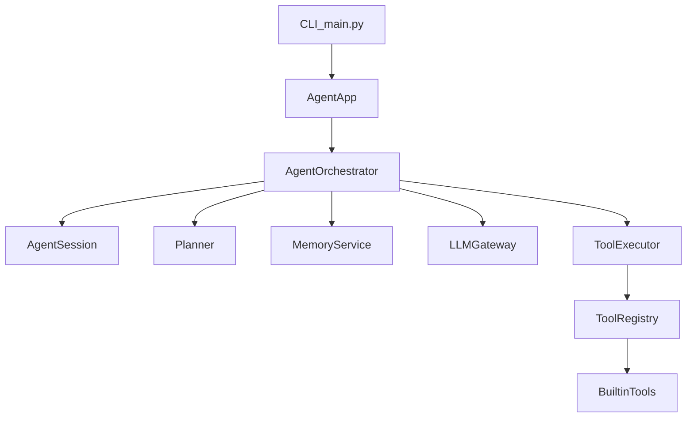
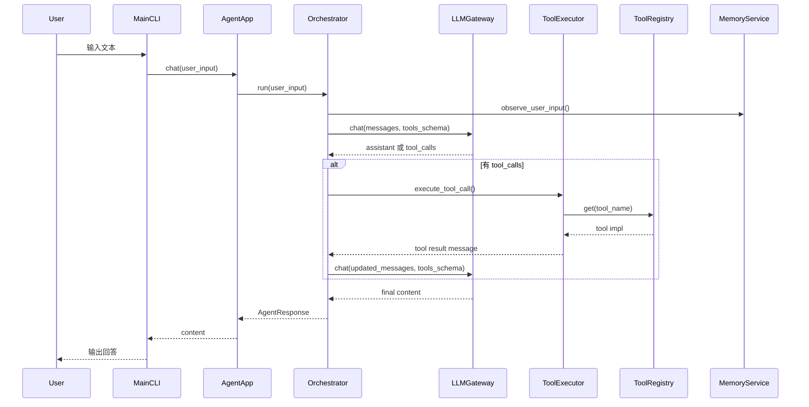

## Jarvis 架构说明（V2）

> 本文档描述当前代码实现（`src/`）对应的真实架构。  
> 重点：Tool 层重构、Agent 全结构化、长期记忆接入。

---

## 1. 架构目标

Jarvis V2 的核心目标：

- Tool 体系从“字典 + 函数”升级为“注册中心 + 执行器 + 统一结果模型”。
- Agent 从单类实现升级为分层类协作（App / Orchestrator / Session / Planner / Memory）。
- 保持 CLI 可持续交互，并支持跨会话记忆。

---

## 2. 顶层分层图

---

## 3. 关键模块职责

### 3.1 入口与应用装配

- `agent.py`
  - 顶层脚本，转发到 `src.main.main()`。
- `src/main.py`
  - 命令行 REPL：读取用户输入、调用 `AgentApp.chat()`、打印输出。
- `src/agent/app.py`
  - `AgentApp` 负责依赖注入：
    - 创建 `AgentEngine` / `Planner` / `MemoryService` / `AgentOrchestrator`
  - `AgentAppConfig` 统一控制 provider、planner 开关、迭代上限、memory 后端等。

### 3.2 Agent 编排层

- `src/agent/orchestrator.py`
  - `AgentOrchestrator` 是主流程核心：
    1. 记录用户输入（会话）
    2. 调用 LLM
    3. 处理 tool_calls（通过 `ToolExecutor`）
    4. 追加 tool 消息并继续循环
    5. 产出 `AgentResponse`
- `src/agent/session.py`
  - `AgentSession` 管理消息历史：
    - `append_user`
    - `append_assistant`
    - `append_assistant_tool_calls`
    - `append_tool_message`
- `src/agent/planner.py`
  - `Planner` 提供规划提示与步骤占位能力（可开关）。
- `src/agent/response.py`
  - `AgentResponse` 统一输出结构（`content` / `steps` / `metadata`）。

### 3.3 Tool 层（重构后）

- `src/tools/base.py`
  - `ToolSpec`：工具描述模型
  - `BaseTool`：工具抽象基类
  - `FunctionTool`：普通 Python 函数的工具适配器
  - `ToolResult`：统一结果模型
- `src/tools/registry.py`
  - `ToolRegistry`：统一注册、查询、导出 OpenAI tools schema。
  - 同时支持：
    - 装饰器注册：`registry.tool(...)`
    - 显式注册：`registry.register_function(...)`
- `src/tools/executor.py`
  - `ToolExecutor` 负责执行工具调用、解析参数、归一化异常。
- `src/tools/bootstrap.py`
  - 提供全局单例：
    - `tool_registry`
    - `tool_executor`
    - `tool`（装饰器入口）
- `src/tools/builtin/basic.py`
  - 内置示例工具：
    - `get_current_time`（装饰器注册）
    - `add_numbers`（显式注册）

### 3.4 LLM 网关层

- `src/engine/base.py`
  - `LLMGateway`：统一 LLM 调用入口，屏蔽 provider 差异。
  - `AgentEngine`：旧命名兼容，继承自 `LLMGateway`。

### 3.5 配置层

- `src/config.py`
  - `MODEL_CONFIG` / `DEFAULT_PROVIDER`
  - `AGENT_CONFIG`（`max_iterations`、`enable_planner`、`memory_backend`、`memory_file_path`）

### 3.6 长期记忆层

- `src/agent/memory.py`
  - `BaseMemoryStore`：存储抽象
  - `FileMemoryStore`：文件持久化实现
  - `MemoryService`：
    - 启动时提供记忆上下文（注入 system prompt）
    - 运行时解析用户输入并更新持久化记忆（当前支持名字、语言偏好）

---

## 4. 运行时数据流

---

## 5. 扩展建议

- 新增工具：在 `src/tools/builtin/` 添加模块并注册，无需改 Orchestrator 主循环。
- 替换记忆后端：实现新的 `BaseMemoryStore`（如 SQLite/Redis）后注入 `MemoryService`。
- 增强 Planner：把占位规划升级为真实“计划-执行-验证”链路。
- 生产化：新增日志、追踪、重试策略与测试覆盖。

---

## 6. 与学习文档关系

- `docs/TEACHING_PLAN.md`：学习路径与阶段目标。
- 本文档：当前代码真实架构快照。

当你重构组件边界时，应优先更新本文档的：

- 分层图
- 关键模块职责
- 运行时数据流

