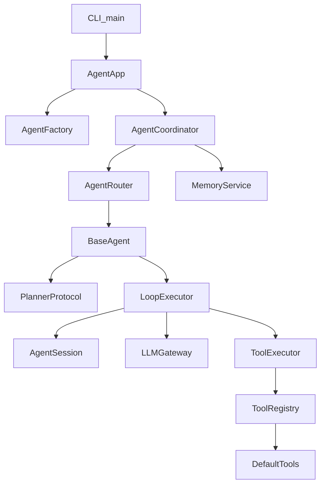
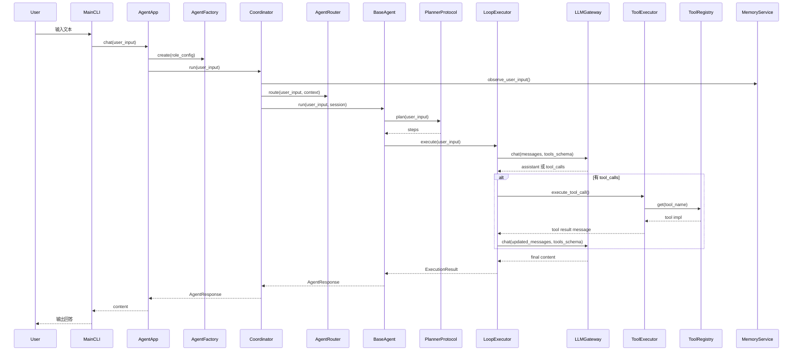

## Jarvis 架构说明

> 描述当前实现对应的分层架构、模块职责与运行时数据流；约束与扩展点供实现与演进时对齐。

---

## 1. 架构目标与约束

- **分层清晰**：Interface（CLI/入口）→ Application（App/Coordinator）→ Domain（Agent/Session/Tools/Memory）→ Infrastructure（LLMGateway/存储/配置）。
- **单一职责**：每层只依赖下层接口，不跨层直连实现。
- **可替换性**：记忆存储、LLM provider、工具集均可通过接口与配置替换，无需改业务编排。
- **可观测与可测试**：关键路径打点；LLM/Tool 可注入 mock 便于单测与集成测试。

---

## 2. 顶层分层图

（当前实现已统一为 Coordinator 路径，不再保留 Planner 双轨。）

---

## 3. 关键模块职责

### 3.1 接口层（Interface）

- `agent.py`：顶层脚本，转发至 `src.interface.cli.main()`，便于通过 `python agent.py` 启动。
- `src/interface/cli.py`：CLI REPL 入口；读取用户输入、调用 `AgentApp.chat()`、输出结果；对未捕获异常做友好提示并保持 REPL 不退出。

### 3.2 应用编排层（Application）

- `src/application/app.py`：`AgentApp` 依赖注入与装配（LLMGateway / MemoryService / AgentCoordinator）；对外 `chat(user_input) -> str`。`AgentAppConfig` 统一控制 provider、迭代上限、planning 开关、memory 后端与路径。启动阶段显式装配 `ToolRegistry/ToolExecutor`（`create_tooling(register_defaults=True)`）。

### 3.3 领域层（Domain）

- **编排核心**：`src/domain/agent/runtime/coordinator.py` 中 `AgentCoordinator` 负责 memory 更新、agent 路由与会话管理；单 Agent 生命周期由 `BaseAgent` 模板方法驱动。
- **会话**：`src/domain/agent/models/session.py` 中 `AgentSession` 管理 messages（append_user / append_assistant / append_assistant_tool_calls / append_tool_message）。
- **规划**：`src/domain/agent/planning/planner.py` 中 `PlannerProtocol` 抽象规划策略，默认实现 `LLMPlanner` / `NullPlanner`。
- **执行**：`src/domain/agent/execution/loop_executor.py` 中 `ExecutorProtocol` 抽象执行策略，默认实现 `LoopExecutor`。
- **工厂**：`src/domain/agent/runtime/factory.py` 中 `AgentFactory` + `PlannerRegistry` + `ExecutorRegistry` 负责可插拔实例化。
- **记忆**：`src/domain/agent/memory/service.py` 中 `MemoryService` 对外提供 build_system_context、observe_user_input；存储由 `BaseMemoryStore` 抽象，实现包括 File / SQLite。
- **工具**：`src/domain/tools/spec/base.py`（ToolSpec / BaseTool / ToolResult）、`src/domain/tools/registry/registry.py`（ToolRegistry）、`src/domain/tools/runtime/executor.py`（ToolExecutor）、`src/domain/tools/runtime/context.py`（RequestContext / ToolContext）；默认工具类在 `src/domain/tools/catalog/builtin/` 下按“一类一文件”实现，由 `src/domain/tools/catalog/defaults.py` 统一装配注册。
- **响应**：`src/domain/agent/models/response.py` 中 `AgentResponse`（content / steps / metadata）。

### 3.4 基础设施层（Infrastructure）

- `src/infrastructure/llm/base.py`：`LLMGateway` 唯一 LLM 出入口；支持重试、超时与错误分类，并将 provider 原生响应适配为统一 `LLMReply` DTO。
- `src/infrastructure/llm/types.py`：`LLMReply`、`LLMToolCall`、`LLMEngineProtocol` 等类型定义，供 Gateway 与编排层使用。
- `src/infrastructure/config.py`：基于 `.env` 的模型配置加载（`JARVIS_PROVIDERS`、`JARVIS_DEFAULT_PROVIDER`、`<PROVIDER>_{BASE_URL,API_KEY,MODEL}`）及 Agent / 记忆 / 工具 / LLM 配置（含重试与 memory 后端/路径）。
- `src/infrastructure/common/errors.py`：统一错误类型（`JarvisError`、`TransientError`、`PermanentError`、`TimeoutError`、`CancelledError`），供 LLM 与工具层重试与上层兜底。
- `src/infrastructure/observability/`：可观测性能力；`metrics` 提供进程内计数与直方图打点，`audit` 提供审计事件（如 memory_updated、tool_execution），与日志配合使用，详见 `docs/OBSERVABILITY.md`。

---

## 4. 运行时数据流

---

## 5. 设计原则摘要

- **AgentApp**：应用壳与组装器；入口形态（CLI/HTTP）与 Agent 内核解耦。
- **编排层**：专注“如何用 LLM + 工具 + 记忆”完成请求；高内聚、易测、易扩展多 Agent。
- **LLMGateway**：屏蔽 provider 差异；重试、超时、日志与指标集中在此层。
- **Memory**：存储抽象 + 多后端（File/SQLite）；提取逻辑通过 Observer/规则扩展，避免散落 if-else。

---

## 6. 扩展点

- **新增工具**：继承 BaseTool 并显式 `registry.register(...)`，框架默认工具见 `src/domain/tools/catalog/builtin/` 与 `src/domain/tools/catalog/defaults.py`，无需改 Orchestrator 主循环。
- **记忆后端**：实现 `BaseMemoryStore`（如 SQLite/Redis）并注入 MemoryService。
- **多 Agent**：引入 BaseAgent + AgentRoleConfig + AgentRouter，新增角色只需配置与注册，无需修改编排引擎。
- **横切能力**：通过 `RequestContext` 贯通 `request_id/trace_id/deadline`；在 LLMGateway 与 ToolExecutor 统一做重试/超时/审计/指标；CLI 负责最终异常兜底与可读错误提示。

重构组件边界时，请同步更新本文档的分层图、模块职责与数据流。
