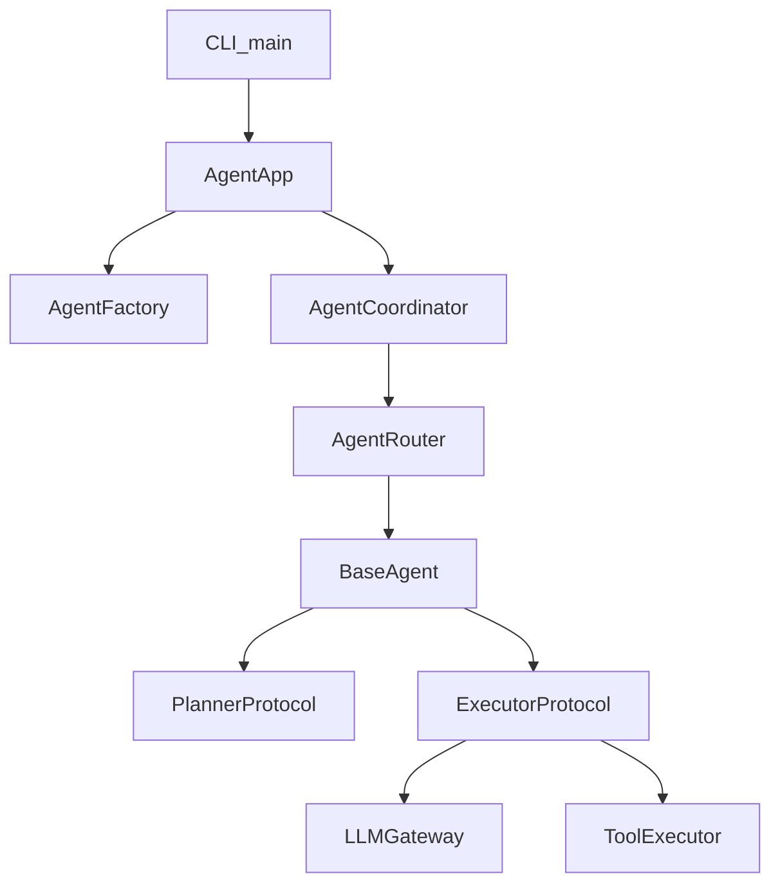

# Agent 平台化抽象总览

> 本文聚焦新架构下的 Agent 平台化能力：`BaseAgent(Template)` + `Planner/Executor(Strategy)` + `AgentFactory` + `AgentRouter`。

---

## 1. 总体视图

---

## 2. BaseAgent：模板方法

- 文件：`src/domain/agent/runtime/base_agent.py`
- 关键点：
  - **配置**：持有 `AgentRoleConfig`（name、system_prompt、tool_names、planner_type、executor_type 等）。
  - **模板方法**：`run(user_input, context, session)`：
    1. 追加用户消息到 `AgentSession`。
    2. 调用 `self.plan(...)` 获取步骤列表（由 `PlannerProtocol` 实现）。
    3. 调用执行策略 `ExecutorProtocol.execute(...)` 驱动 LLM + 工具循环。
    4. 统一构建 `AgentResponse(content, steps, metadata)`。
  - **可定制点**：`_build_response(result, steps)` 可在子类中覆写，定制响应格式。

---

## 3. Planner & Executor：策略接口

### 3.1 PlannerProtocol

- 文件：`src/domain/agent/planning/planner.py`
- 接口：
  - `plan(user_input, *, session, context) -> list[str]`
- 默认实现：
  - `NullPlanner`：始终返回空步骤。
  - `LLMPlanner`：基于 LLM 的规划器，从已有 `PlanningAgent` 提取，实现“将完整对话历史 + 新输入”喂给 LLM，让其按行输出步骤。

### 3.2 ExecutorProtocol / LoopExecutor

- 文件：`src/domain/agent/execution/loop_executor.py`
- 接口：
  - `execute(user_input, *, tools: ToolSet, session, context, steps) -> ExecutionResult`
- 默认实现：
  - `LoopExecutor`：负责单次请求内的 LLM + 工具循环，不再关心 Memory 与 session 构建。
  - 从旧的 `AgentOrchestrator.run()` 中抽取核心循环逻辑，保留：
    - 最大迭代次数与连续工具失败阈值。
    - `phase_log` 阶段记录（think/plan/act/review）。
    - 连续失败后的“收敛提示词”与最终回答策略。

---

## 4. AgentRoleConfig：声明式角色

- 文件：`src/domain/agent/config/role.py`
- 字段示例：
  - `name`: `"default"` / `"planner"` / `"researcher"` 等。
  - `system_prompt`: 角色系统提示词。
  - `tool_names`: 可见工具子集（缺省即所有已注册工具）。
  - `planner_type`: `"null"` / `"llm"` / 自定义策略标识。
  - `executor_type`: `"loop"` / 自定义执行策略标识。
  - `max_iterations`: 针对该 Agent 的最大迭代次数。
  - `metadata`: 预留扩展字段（如标签、路由权重等）。

借助 `AgentRoleConfig`，新增一个 Agent 角色通常只需要：

1. 写好系统 Prompt。
2. 选定（或扩展）规划/执行策略类型。
3. （可选）限制可见工具集合。

无需修改编排引擎或执行器内部逻辑。

---

## 5. AgentFactory：装配中心

- 文件：`src/domain/agent/runtime/factory.py`
- 职责：
  - 持有 `PlannerRegistry` 与 `ExecutorRegistry`，根据 `planner_type` / `executor_type` 创建对应策略实例。
  - 基于 `ToolRegistry` + `tool_names` 生成 `ToolSet` 视图。
  - 最终产出 `ConfigurableAgent`（`BaseAgent` 的默认实现）。
- 默认注册：
  - `"null"` → `NullPlanner`
  - `"llm"` → `LLMPlanner`
  - `"loop"` → `LoopExecutor`

通过扩展 `PlannerRegistry` / `ExecutorRegistry`，可以引入：

- 例如 `"react"` planner、`"tree_of_thoughts"` planner。
- 例如 `"streaming_loop"` 或 `"self_critique_loop"` executor。

---

## 6. AgentRouter 与多 Agent 编排

- 文件：`src/domain/agent/runtime/router.py`、`src/domain/agent/runtime/coordinator.py`
- 默认实现：
  - `DefaultRouter`：始终路由到配置中的默认 Agent 名称。
- 可扩展实现：
  - 按任务类型（如“写代码 / 查数据 / 翻译”）路由到不同 Agent。
  - 按对话阶段或用户标签进行路由（例如新人引导 Agent vs 高级用户 Agent）。
- `AgentCoordinator` 负责：
  - 调用 `MemoryService.observe_user_input` 更新长期记忆。
  - 基于记忆构建 system prompt（并在复用 session 时刷新首条 system 消息）。
  - 调用 `AgentRouter.route(user_input, context)` 决定使用哪个 Agent。
  - 维护 `last_session` 以支持多轮对话。

---

## 7. 与工具与记忆层的关系

- 工具：
  - `ToolSet` 封装 `ToolRegistry` 的一个“子视图”，支持 per-agent 工具隔离。
  - 执行阶段统一通过 `ToolExecutor` 完成单次工具调用与打点。
- 记忆：
  - `MemoryService` 仍然是长期记忆的唯一出入口。
  - 新架构将“何时更新记忆 / 何时拼接记忆到 system prompt”彻底收敛到 `AgentCoordinator`，执行器不再直接触碰 Memory。

---

## 8. 如何在此基础上扩展

- 新增角色：
  - 在应用层定义新的 `AgentRoleConfig` 并交给 `AgentFactory` 创建 Agent 实例。
  - 可通过自定义 `AgentRouter` 实现“按输入内容路由到不同角色”。
- 新增 Planner / Executor：
  - 新建实现类满足对应 Protocol。
  - 在 `PlannerRegistry` / `ExecutorRegistry` 中注册一个新的 type 标识。
  - 在 `AgentRoleConfig` 中使用该标识即可，无需改动编排层。

