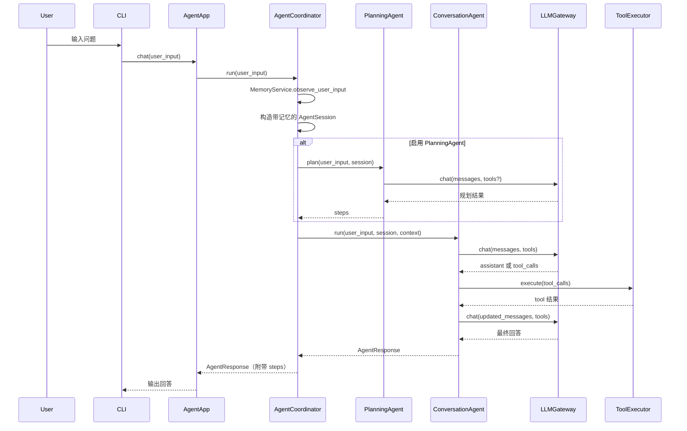

## 多 Agent 设计与使用

> 本文聚焦 `BaseAgent` / `ConversationAgent` / `PlanningAgent` / `AgentCoordinator` 以及相关配置，帮助人类与 Agent 快速理解和使用多 Agent 模式。

---

## 1. 设计目标

- **抽象统一**：通过 `BaseAgent` 给所有 Agent 定义统一接口，便于扩展和编排。
- **职责分离**：将“规划”和“执行/对话”角色拆分为不同 Agent，由协调器统一调度。
- **统一路径**：默认采用 Coordinator + PlanningAgent + ConversationAgent，不再保留单 Orchestrator 路径。
- **接口兼容**：保持 `AgentApp.chat(user_input)` 和 CLI 入口不变。

---

## 2. 组件总览

| 组件 | 文件 | 职责 |
|------|------|------|
| BaseAgent | `src/agent/base_agent.py` | 抽象 Agent 接口（plan + run） |
| ConversationAgent | `src/agent/coordinator.py` | 通用对话/工具执行 Agent，内部复用 `AgentOrchestrator` |
| PlanningAgent | `src/agent/coordinator.py` | 规划型 Agent，仅生成步骤列表，不执行工具 |
| AgentCoordinator | `src/agent/coordinator.py` | 多 Agent 编排入口，负责驱动 PlanningAgent / ConversationAgent 协作 |
| AgentApp / AgentAppConfig | `src/agent/app.py` | 统一装配 Coordinator 路径并透传 RequestContext |

---

## 3. BaseAgent 抽象

位置：`src/agent/base_agent.py`

- 接口：
  - `name: str`：Agent 标识，默认为类名。
  - `plan(user_input: str, session: AgentSession) -> List[str]`：可选规划阶段，默认返回空列表。
  - `run(user_input: str, *, context: Any | None, session: AgentSession | None) -> AgentResponse`：执行对话/工具调用，返回统一的 `AgentResponse`。
- 设计约束：
  - `run` 必须是幂等于“一次用户请求”的逻辑入口，由 Coordinator 调用。
  - `plan` 不强制实现，但推荐对复杂 Agent 提供（便于 Coordinator 或上层 UI 展示步骤）。

---

## 4. ConversationAgent

位置：`src/agent/coordinator.py`

- 职责：
  - 面向一般对话与工具调用场景。
  - 内部通过组合的方式复用 `AgentOrchestrator`，不重复实现 LLM+工具循环逻辑。
- 关键点：
  - 构造函数注入：`LLMGateway`、`ToolRegistry`、`ToolExecutor`、`AgentOrchestratorConfig`、`MemoryService`。
  - `run()` 直接委托给 `_orchestrator.run(user_input, context=context, session=session)`，共享上层传入的 `AgentSession`。
  - `plan()` 默认不承担规划职责（返回空列表），规划统一由 `PlanningAgent` 承担。

---

## 5. PlanningAgent

位置：`src/agent/coordinator.py`

- 职责：
  - 仅负责任务规划，不执行任何工具：
    - 输入：用户任务描述。
    - 输出：多行文本，每行一个步骤（最多保留前 20 行）。
  - 可独立提供规划结果，也可由 Coordinator 作为“预处理阶段”调用。
- 实现要点：
  - 使用独立的 system prompt，例如提示“只输出步骤，不要执行工具”。
  - 通过 `engine.chat(messages, tools=None)` 调用 LLM。
  - `plan()` 解析 LLM 返回的文本为步骤列表。
  - `run()` 返回 `(规划完成)` + steps 的 `AgentResponse`，主要用于调试或单独调用场景。

---

## 6. AgentCoordinator

位置：`src/agent/coordinator.py`

### 6.1 职责

- 对一次用户请求进行整体编排：
  1. 更新长期记忆（MemoryService）。
  2. 构造带记忆上下文的 `AgentSession`。
  3. 可选调用 `PlanningAgent.plan(...)` 生成步骤列表。
  4. 选择并调用 `ConversationAgent.run(...)` 完成具体对话与工具调用。
  5. 将规划步骤合并进最终 `AgentResponse`（若 ConversationAgent 未覆盖 steps）。

### 6.2 流程示意

### 6.3 Agent 选择策略

- 当前实现中，Coordinator：
  - 依赖名称 `"ConversationAgent"` 获取对话 Agent。
  - 若找不到该名称，会在已注册 Agent 中搜索第一个 `ConversationAgent` 实例。
  - 至少需要一个 `ConversationAgent`，否则抛出错误。
- 后续可扩展：
  - 添加 `AgentRegistry`，支持基于任务类型、标签或路由规则选择不同 Agent。

---

## 7. AgentApp 与配置

位置：`src/agent/app.py`

- `AgentAppConfig` 关键字段：
  - `enable_planning: bool`：是否启用 `PlanningAgent` 预规划步骤。
- 行为：
  - `AgentApp` 始终构造：
    - 一个 `ConversationAgent`（内部持有 Orchestrator）。
    - 可选一个 `PlanningAgent`（当 `enable_planning=True` 时）。
    - 一个 `AgentCoordinator`，持有上述 Agent 与 `MemoryService`、`LLMGateway`、`ToolRegistry`、`ToolExecutor`。
  - `AgentApp.chat()` 委托给 Coordinator 的 `run()`。
- 环境变量映射（见 `src/config.py`）：
  - `JARVIS_ENABLE_PLANNING=true/false`（兼容旧变量 `JARVIS_ENABLE_PLANNER`）

---

## 8. 何时开启规划

- 建议开启 `enable_planning` 的场景：
  - 需要在回答前先给用户或系统一个清晰的步骤计划。
  - 上层需要展示步骤或审计规划输出。
- 可关闭 `enable_planning` 的场景：
  - 任务简单、追求最低延迟。

---

## 9. 对文档与 Agent 的阅读建议

- **人类读者**：
  - 从 `README.md` 与 `docs/OVERVIEW.md` 获得整体认知。
  - 再看 `docs/ARCHITECTURE.md` 的分层图与数据流。
  - 若启用多 Agent，重点阅读本文与 `docs/DESIGN_AGENT.md` 中的 Agent 部分。
- **Agent/工具链**：
  - 可将本文件作为“多 Agent 行为规范”的主参考，实现自动化分析或重构时遵循此约定。

