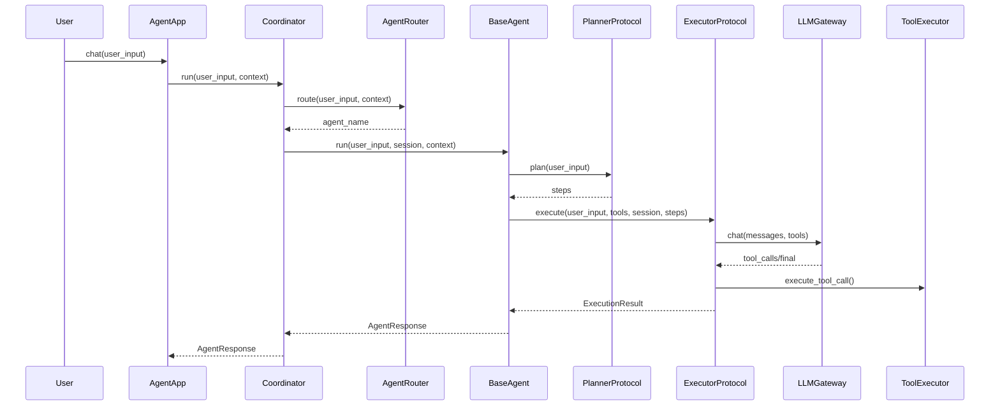

## 多 Agent 设计与使用

> 本文聚焦 `BaseAgent` / `AgentFactory` / `AgentRouter` / `AgentCoordinator` 的平台化组合方式。

---

## 1. 设计原则

- **模板统一生命周期**：所有角色共享 `BaseAgent.run()` 模板流程。
- **策略可插拔**：规划与执行通过 Protocol 抽象，运行时可切换实现。
- **工厂声明式装配**：角色由 `AgentRoleConfig` 定义，不再硬编码构造类。
- **路由解耦编排**：Coordinator 不依赖类名字符串，改由 `AgentRouter` 决策。

---

## 2. 组件总览

| 组件 | 文件 | 职责 |
|------|------|------|
| AgentRoleConfig | `src/domain/agent/role_config.py` | 角色名、提示词、工具子集、策略类型 |
| BaseAgent / ConfigurableAgent | `src/domain/agent/base_agent.py` | `plan -> execute -> response` 模板方法 |
| PlannerProtocol | `src/domain/agent/planner.py` | 规划策略接口（`LLMPlanner` / `NullPlanner`） |
| ExecutorProtocol | `src/domain/agent/agent_executor.py` | 执行策略接口（`LoopExecutor`） |
| AgentFactory | `src/domain/agent/factory.py` | 根据角色配置创建 Agent 实例 |
| AgentRouter | `src/domain/agent/router.py` | 按输入/上下文选择目标 Agent |
| AgentCoordinator | `src/domain/agent/coordinator.py` | 管理 memory、route、session 与调度 |

---

## 3. 数据流

---

## 4. 扩展方式

- 新增角色：新增一个 `AgentRoleConfig`，调用 `AgentFactory.create()`。
- 新增规划策略：实现 `PlannerProtocol` 并注册 `PlannerRegistry`。
- 新增执行策略：实现 `ExecutorProtocol` 并注册 `ExecutorRegistry`。
- 新增路由规则：实现 `AgentRouter` 替换 `DefaultRouter`。

