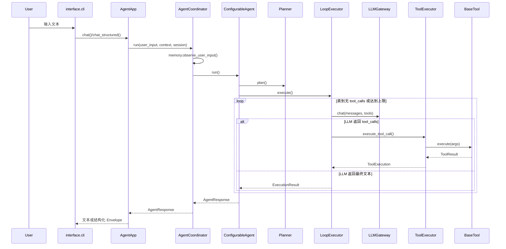

# Jarvis 项目实现全景指南（实现导向）

本文档面向开发者，基于当前代码实现（`src/` 与 `tests/`）说明系统如何工作、如何扩展、如何排障。

## 1. 项目定位

Jarvis 是一个本地可运行的 Agent 框架，目标是提供：

- 可组合的 Agent 编排（规划 + 执行 + 工具）
- 可插拔长期记忆（File / SQLite）
- 统一 LLM 网关（多 provider）
- 具备基础可靠性（重试、超时、取消）与可观测性（metrics + audit）

入口为：

- `python agent.py` -> [`src/interface/cli.py`](../src/interface/cli.py)
- 应用装配层核心在 [`src/application/app.py`](../src/application/app.py)

## 2. 分层架构

### 2.1 目录与职责

| 层级 | 目录 | 主要职责 |
|---|---|---|
| Interface | `src/interface` | CLI 交互、日志初始化、异常兜底 |
| Application | `src/application` | 应用装配：LLM、Tool、Memory、AgentCoordinator |
| Domain-Agent | `src/domain/agent` | Agent 角色配置、规划策略、执行循环、协调器、会话模型 |
| Domain-Tools | `src/domain/tools` | ToolSpec、注册中心、执行器、内置工具、安全校验 |
| Infrastructure | `src/infrastructure` | 配置加载、LLM Gateway、错误类型、可观测性 |

### 2.2 主调用时序



## 3. 核心对象模型

### 3.1 RequestContext（链路上下文）

定义：[`src/domain/tools/runtime/context.py`](../src/domain/tools/runtime/context.py)

关键字段：

- `request_id` / `trace_id`：请求链路标识
- `session_id`：会话标识（`AgentApp` 生命周期内固定）
- `deadline_ts` / `cancelled`：超时与取消控制
- `extra`：跨层扩展字段

关键方法：

- `create(timeout_seconds=...)`
- `time_left_seconds()`
- `should_stop()`

### 3.2 AgentSession（对话状态）

定义：[`src/domain/agent/models/session.py`](../src/domain/agent/models/session.py)

特点：

- 自动首条 `system` 消息
- 支持 `append_user/assistant/tool`
- 支持 `refresh_system_prompt`（会话复用时刷新记忆上下文）
- 支持 `trim(max_messages)`（保留 system + 最近 N-1 条）

### 3.3 AgentResponse / ChatEnvelope

- 领域返回：`AgentResponse(content, steps, metadata)`
- 应用层返回：`ChatEnvelope(version, answer, steps, reason, tool_traces, ids...)`

其中 `chat()` 仅返回文本，`chat_structured()` 返回完整结构，便于前端或 API 层使用。

## 4. Agent 执行链拆解

### 4.1 装配入口：AgentApp

实现：[`src/application/app.py`](../src/application/app.py)

初始化阶段完成：

- `validate_settings()` 配置校验
- `LLMGateway(provider)`
- `create_tooling(register_defaults=True)` -> `ToolRegistry + ToolExecutor`
- `MemoryService`（由 `memory_backend` 决定 File/SQLite）
- `AgentFactory.create(role_config)` -> `ConfigurableAgent`
- `AgentCoordinator(agents, router, memory_service)`

运行阶段：

1. `RequestContext.create(...)`
2. `coordinator.run(...)`
3. 更新内部 `_session`（跨轮对话复用）
4. 归一化 metadata -> `ChatEnvelope`

### 4.2 协调器：AgentCoordinator

实现：[`src/domain/agent/runtime/coordinator.py`](../src/domain/agent/runtime/coordinator.py)

职责：

- 在每轮请求前 `observe_user_input` 更新长期记忆
- 通过 `router.route` 选目标 Agent
- 生成 / 刷新 system prompt（含记忆注入）
- 保留 `last_session` 供上层复用

### 4.3 规划器：NullPlanner / LLMPlanner

实现：[`src/domain/agent/planning/planner.py`](../src/domain/agent/planning/planner.py)

- `NullPlanner`：返回空步骤
- `LLMPlanner`：读取完整历史，尝试 JSON 数组解析，不成功时按行切分

### 4.4 执行器：LoopExecutor

实现：[`src/domain/agent/execution/loop_executor.py`](../src/domain/agent/execution/loop_executor.py)

关键机制：

- 最大迭代 `max_iterations`
- 连续工具失败熔断 `max_consecutive_tool_failures`
- `context.should_stop()` 中断（超时/取消）
- 将 `tool_traces`、`phase_log` 写入 metadata

## 5. 工具体系实现

### 5.1 组成

- 协议层：`ToolSpec / ToolResult / BaseTool`
  - [`src/domain/tools/spec/base.py`](../src/domain/tools/spec/base.py)
- 注册层：`ToolRegistry`
  - [`src/domain/tools/registry/registry.py`](../src/domain/tools/registry/registry.py)
- 执行层：`ToolExecutor`
  - [`src/domain/tools/runtime/executor.py`](../src/domain/tools/runtime/executor.py)
- 内置工具：`get_current_time / add_numbers / http_get / http_post_json`
  - [`src/domain/tools/catalog/builtin`](../src/domain/tools/catalog/builtin)

### 5.2 ToolExecutor 行为

执行路径：

1. 校验工具存在
2. 解析参数 JSON
3. 依据 `ToolSpec.parameters` 做轻量 schema 校验
4. 执行工具并记录 metrics/audit
5. 对 `idempotent=True` 工具执行异常做重试

安全机制：

- 参数日志脱敏（`token/api_key/password/...`）
- HTTP 工具 URL 安全校验（协议、localhost、内网 IP、DNS 解析）

### 5.3 新增工具方式（推荐）

```python
from src.domain.tools.spec import BaseTool, ToolResult, ToolSpec

class EchoTool(BaseTool):
    def __init__(self) -> None:
        super().__init__(
            ToolSpec(
                name="echo",
                description="回显输入字符串",
                parameters={
                    "type": "object",
                    "properties": {"text": {"type": "string"}},
                    "required": ["text"],
                },
                idempotent=True,
            )
        )

    def execute(self, args, context=None):
        _ = context
        return ToolResult(ok=True, content=args["text"])
```

注册位置建议：

- 应用启动时通过 `registry.register(EchoTool())`
- 或在 `create_tooling` 上层包装一个自定义装配函数

## 6. 长期记忆体系实现

实现：[`src/domain/agent/memory/service.py`](../src/domain/agent/memory/service.py)

### 6.1 存储后端

- `FileMemoryStore`：JSON 文件
- `SQLiteMemoryStore`：`memory_items(namespace, key, value_json, updated_at)`

默认命名空间：`profile`

### 6.2 观测器（Observers）

- `NameObserver`：提取 “我叫/以后叫我”
- `LanguageObserver`：提取 “请用中文/please answer in english”
- `TimezoneObserver`：提取时区

流程：

1. `observe_user_input()` 加载快照
2. observers 修改快照并返回变更键
3. 有变更则持久化并发送 `memory_updated` 审计事件

### 6.3 Prompt 注入安全

`build_system_context()` 通过 `_sanitize_prompt_value` 做：

- 去换行
- 去反引号
- `{}` 转 `()`
- 长度截断

用于降低记忆注入污染风险。

## 7. LLM 网关实现

实现：[`src/infrastructure/llm/base.py`](../src/infrastructure/llm/base.py)

能力：

- 从 `config.py` 读取 provider 与模型配置
- 统一调用 OpenAI 兼容接口
- 可重试错误判定（超时/连接/429/5xx）
- 指数退避 + 抖动
- 链路日志 + metrics

调用协议：

- 入参：`messages`, `tools`, `context`
- 出参：`LLMReply(content, tool_calls, raw)`

## 8. 配置项总览

实现：[`src/infrastructure/config.py`](../src/infrastructure/config.py)

常用环境变量：

| 变量 | 默认值 | 说明 |
|---|---|---|
| `JARVIS_PROVIDERS` | `deepseek,gemini` | provider 列表 |
| `JARVIS_DEFAULT_PROVIDER` | `deepseek` | 默认 provider |
| `<PROVIDER>_BASE_URL` | 空 | 模型网关地址 |
| `<PROVIDER>_API_KEY` | 空 | API 密钥 |
| `<PROVIDER>_MODEL` | 空 | 模型名 |
| `JARVIS_MAX_ITERATIONS` | `10` | 执行循环上限 |
| `JARVIS_MAX_CONSECUTIVE_TOOL_FAILURES` | `3` | 连续工具失败熔断阈值 |
| `JARVIS_ENABLE_SESSION_TRIM` | `true` | 是否裁剪会话 |
| `JARVIS_MAX_SESSION_MESSAGES` | `80` | 会话消息数上限 |
| `JARVIS_REQUEST_TIMEOUT_SECONDS` | `120` | 请求级超时 |
| `JARVIS_ENABLE_PLANNING` | `true` | 启用 LLM 规划 |
| `JARVIS_MEMORY_BACKEND` | `sqlite` | `file` / `sqlite` |
| `JARVIS_MEMORY_FILE_PATH` | `.jarvis/memory.json` | File 记忆路径 |
| `JARVIS_MEMORY_DB_PATH` | `.jarvis/memory.db` | SQLite 记忆路径 |
| `JARVIS_LLM_MAX_RETRIES` | `3` | LLM 重试次数 |
| `JARVIS_TOOL_MAX_RETRIES` | `2` | 工具重试次数（仅幂等） |
| `JARVIS_HTTP_ALLOW_HOSTS` | 空 | HTTP 工具主机白名单 |
| `JARVIS_HTTP_DENY_HOSTS` | 空 | HTTP 工具主机黑名单 |

## 9. 可观测性与调试

### 9.1 指标

实现：[`src/infrastructure/observability/metrics.py`](../src/infrastructure/observability/metrics.py)

当前埋点来源：

- `LLMGateway`：`llm_calls_total`, `llm_call_latency_ms`
- `ToolExecutor`：`tool_calls_total`, `tool_call_latency_ms`, `retry_total`
- `LoopExecutor`：`orchestrator_runs_total`, `orchestrator_iterations`

### 9.2 审计

实现：[`src/infrastructure/observability/audit.py`](../src/infrastructure/observability/audit.py)

当前事件：

- `memory_updated`
- `tool_execution`

记录 `payload_hash`，避免直接输出敏感 payload。

## 10. 测试与质量门禁

已有测试文件：

- [`tests/test_agent_e2e.py`](../tests/test_agent_e2e.py)
- [`tests/test_memory.py`](../tests/test_memory.py)
- [`tests/test_config.py`](../tests/test_config.py)
- [`tests/test_reliability_observability.py`](../tests/test_reliability_observability.py)

本地运行：

```bash
pytest -q
ruff check src tests
mypy src
```

CI：见 [`.github/workflows/ci.yml`](../.github/workflows/ci.yml)

## 11. 扩展实践指南

### 11.1 增加新 Agent 角色

步骤：

1. 定义 `AgentRoleConfig(name, system_prompt, planner_type, executor_type, tool_names)`
2. 用 `AgentFactory.create(config)` 构建 Agent
3. 将新 Agent 注入 `AgentCoordinator(agents=[...], router=...)`
4. 替换 `DefaultRouter` 为自定义 Router

### 11.2 自定义 Planner / Executor

步骤：

1. 通过 `PlannerRegistry.register("your_planner", builder)`
2. 或 `ExecutorRegistry.register("your_executor", builder)`
3. 在 `AgentRoleConfig` 指定对应 type

### 11.3 替换记忆存储

步骤：

1. 继承 `BaseMemoryStore` 实现 `load/save`（可选 `get/set`）
2. 构造 `MemoryService(store=YourStore(...))`
3. 注入 `AgentCoordinator`

## 12. 已知边界

当前实现优点是结构清晰、可测试性强、扩展点明确；同时仍有工程边界：

- 未提供 HTTP/API Server，仅 CLI 入口
- `MetricsCollector` 为进程内暂存，未对接外部监控后端
- Memory Observer 规则偏启发式，语义覆盖有限
- 多租户/并发会话场景尚未产品化设计

建议搭配 `docs/ARCHITECTURE_REVIEW_AND_GUIDANCE.zh-CN.md` 一并阅读，按优先级推进改造。
